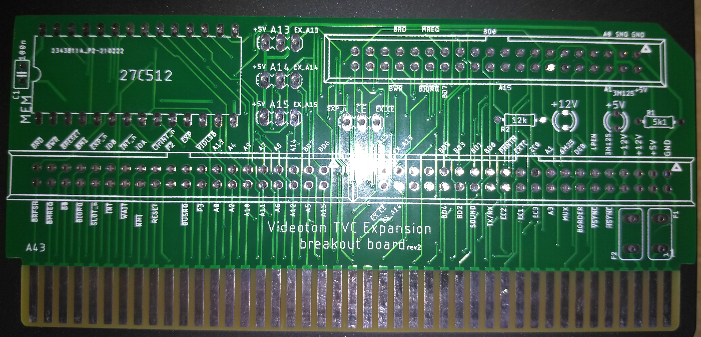

# TVC-Breakout

## Magyar
Ez a repo olyan nyáklapok EagleCAD terveit tartalmazza, melyek a Videoton TVC számítógép programmodul és felsõ bõvítõ-helyeinek kivezetéseit teszik könnyen (könnyebben) elérhetõvé hardverfejlesztõk számára.
- _cart_ könyvtár tartalmazza a programmodul forrás file-jait, gerber file-t és a kapcsolási rajzot pdf-ben is.
- _exp_ könyvtár tartalmazza a felsõ bõvítõ forrás file-jait, gerber file-t és a kapcsolási rajzot pdf-ben is. Az r2-es változat az r1-hez képest annyival tud többet, hogy arra került egy 27C512 -es ROM foglalat is, kapcsolható A13-A15 vonalakkal. Az ellenállások 3# -ra lettek tervezve, hogy egyszerûbben lehessen bele LED -et tenni.
- _imgs_ könyvtár a már elkészült nyáklapokról tartalmaz fényképeket
- _lib_ könvytár a szükséges alkatrész-könyvtárakat tartalmazza
- OPCIONÁLIS: Az exp lap r2 -es változata tartalmazhat egy 64kB -os EEPROM -ot. Ha ebbõl csak a legfelsõ 8kB van használatban, akkor nem kell semmi mást csinálni a lapon. Amennyiben lapozás szükséges, az EEPROM az A13-A15 jeleit a lap kívülrõl kell megkapja (neked kell legenerálnod és az EX_A13, EX_A14, EX_A15 illetve az /EX_CE helyeken visszahozni a jobb alsó tüskesoron). Ilyenkor az A13, A14, A15 és /CE jumperek alját vágni kell és beállítani, hogy honnan érkezzen a címjel + /CE jel. A /CE jel alapból a TVC /EXPn jele. 
- OPCIONÁLIS: a jeleket vagy a kábelek beforrasztásával, vagy egy tüskesor beillesztésével és szalagkábellel lehet elvezetni.
-- Az exp lapon 3db 2x20 -as tüskesornak van hely amikhez 40 eres szalagkábelek kellenek. Ha megnézed, az egyik tüskesor kiválogatott jeleket tartalmaz. Tanulmányozd, mert lehet, h neked elég csak azokat a jeleket elhozni a lapról. Az alsó két headersor az összes TVC kivezetést tartalmazza.
-- A cart lapon 1db 2x17 -es tüskesornak van hely, amihez 34 eres szalagkábel kell.
- OPCIONÁLIS: Mindkét lap tartalmaz helyeket ú.n. polifuse-nak, azaz öngyógyító biztosítéknak a +5V -os és a +12V (csak exp) ágon. Jelölésük F1 (és F2 az exp lapon). Nem muszáj berakni, viszont védelmet jelent a TVCnek. Ha berakod, akkor ne felejtsd el elvágni alul a nyákon az átvezetést (ha már elvágtad, akkor be KELL rakni a biztosítékot)!
- OPCIONÁLIS: Mindkét lap tartalmaz LED-nek és ellenállásnak helyet, melyek visszajelzésként tudnak szolgálni a +5V és a +12V (csak exp lapon) ágaknak.
-- Az exp lapon 3mm -es LEDek és 5k1 és 12k értékû ellenállások kellenek
-- A cart lapon 5mm -es LED és egy 5k1 értékû ellenállás kell
-- Az értékek nem kõbevésett számok, ha azt akarod, hogy jobban világítson a LEDed, akkor rakj be kisebb ellenállást - de csak ésszel (tudd, hogy mit csinálsz)!
- FONTOS: a felsõ bõvítõ r1 és r2-es változata is le lett gyártva, mûködnek. A programmodulból gyártott r1 -es változatban a GND nem volt bekötve. Ez lett javítva az r2-ben, viszont abból még nem gyártattam, de más változtatás nem lett a nyáklapon, mûködnie kell. Az r1-es - hibás - válozatot nem is töltöttem fel, minek.

## English
This repository contains breakout board PCB plans for the Videoton TVC computer in EagleCAD. There are two type of TVC sockets I plan to provide help in this repo : 
- cartridge socket: This is the programmodule connector on the left side of the computer (cartridges uses this socket).
- expansion socket: There are 4 sockets on the top of the computer for IO board expansions (floppy and serial expansion cards use these connectors)

These PCBs is aiming to help new card builders to get easily all the signals from each of the connector. 
- _cart_ directory contains source files for the cartridge ('programmodul')
- _exp_ directory contains source files for the expansion ports.
- _imgs_ contains images about manufactured PCBs
- _lib_ directory contains the necessary library files
- OPTIONAL: both of the PCBs contain places for polifuse (marked as F1 and F2). If you place those you have to cut the wire on the back side of the PCB
- OPTIONAL: both of the PCBs contain places for LED and resistor. Those are just a visual signal to the hw developer if the TVC PSU provides the power (overheated TVC PSU needs some time to 'recover'). The resistor values are 5k1 for the 5V and 12k for the 12V, but those can be lowered if you want brighter LEDs (know what you are doing there!!). The LEDs are 3mm on the exp PCB and 5MM on the cart PCB.
- Both revisions of the exp PCB was manufactured and they works properly. The cart PCB r1 contained an error (GND pin was not connected on the header) so I fixed that but it wasn't manufactured yet. No other change was made, r1 otherwise works. 

# License: GNU GPL v3
    

